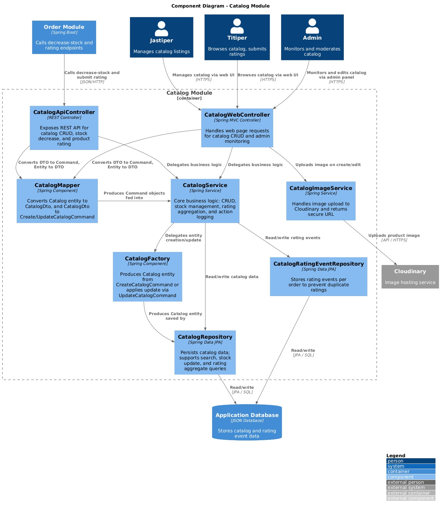
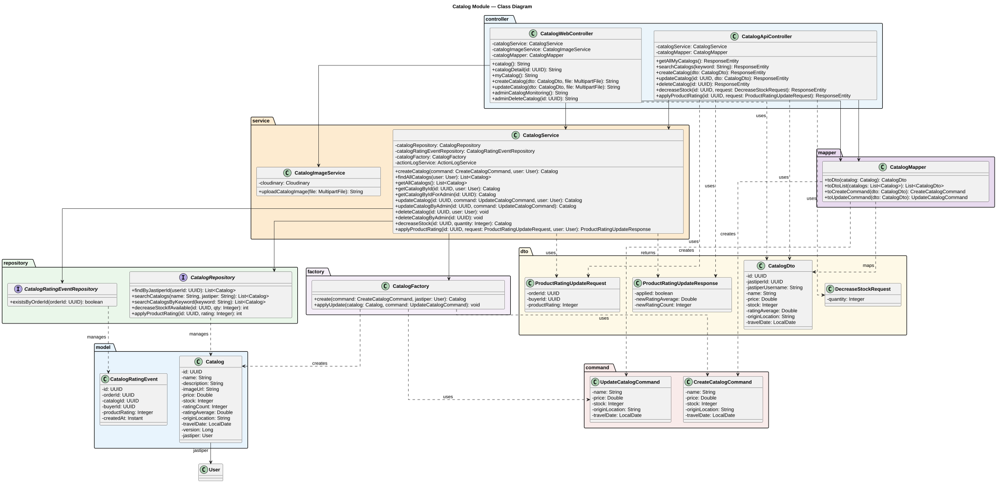
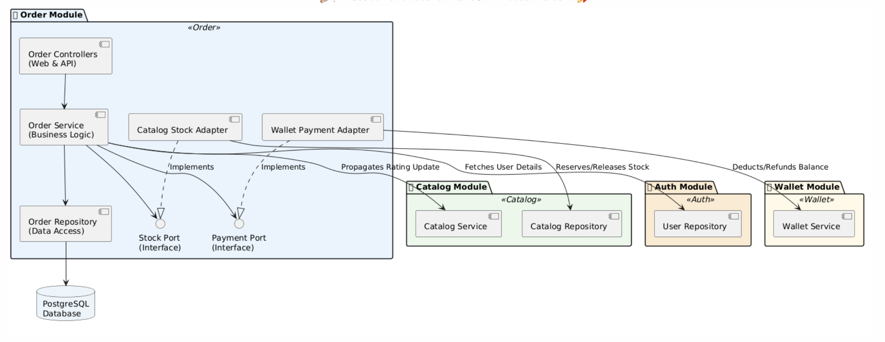
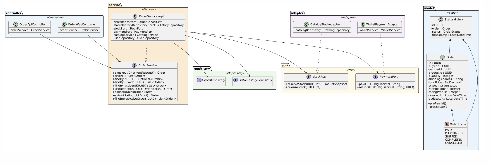

# Advanced Programming B08 - JSON
## Group Software Architecture - Tutorial 09

| Name | NPM |
|---|---|
| Ghozam Muliawan Sholihin | 2406495565 |
| Benedictus Lucky Win Ziraluo | 2406355174 |
| Clairine Christabel Lim | 2406359941 |
| Andrew Wanarahardja | 2406407373 |

---

## 1. The Current Architecture
### Context Diagram

### Container Diagram

### Deployment Diagram

---

## 2. The Future Architecture

- Context Diagram tidak ada yang berubah

---
## 3. Explanation of Risk Storming

**Architectural Risk Analysis (Kondisi Saat Ini)**
- Dalam arsitektur monolith Jastip Marketplace saat ini, seluruh modul berjalan dalam satu proses Spring Boot dengan satu shared database di Supabase. Risiko terbesar terletak pada tight-coupling antar modul dan single point of failure pada database tersebut. Saat Titiper melakukan checkout, OrderService memanggil CatalogService dan WalletService secara sinkronus dalam satu transaksi, jika salah satu gagal, seluruh operasi ikut gagal secara beruntun. Lalu, seluruh data aplikasi juga tersimpan dalam satu database yang sama. Jika database ini mengalami downtime atau korupsi data, seluruh sistem mati sekaligus, tanpa adanya backup.

**Architecture Modification Justification (Arsitektur Masa Depan)**
- Untuk memitigasi risiko tersebut, arsitektur dimodifikasi menjadi microservice dengan empat database terpisah per service, sehingga kegagalan satu database tidak merambat ke service lain. Komunikasi antar service yang tidak membutuhkan respons langsung, seperti pembuatan wallet saat register, refund saat order dibatalkan, dan update rating catalog yang akan dialihkan ke RabbitMQ sebagai message broker. Dengan ini, jika Wallet Service down, pesan refund tetap tersimpan aman di antrean dan diproses saat service kembali normal, tanpa mengganggu Order Service. Selain itu, karena platform ini berpotensi mengalami lonjakan traffic tinggi saat Jastiper membuka slot perjalanan populer dan banyak Titiper berebut checkout secara bersamaan, Nginx Load Balancer ditambahkan untuk mendistribusikan beban ke beberapa instance service secara merata yang akan memastikan sistem tetap responsif di kondisi high load atau "war" sekalipun.

---

## 4. Individual Works (Catalog) - Ghozam Muliawan Sholihin

### Component Diagram

---

## 5. Individual Works (Order) - Clairine Christabel Lim

### Component Diagram

